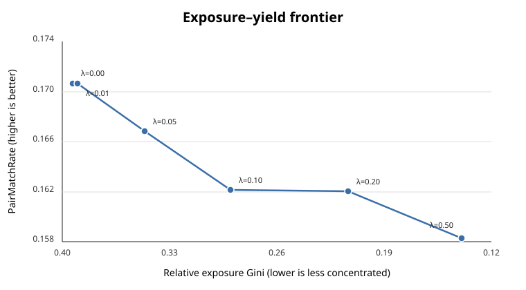

# ReciprocalMatchLab

[](https://github.com/bagheri365/ReciprocalMatchLab/actions/workflows/ci.yml)

**Reciprocal recommendation and marketplace allocation for two-sided matching systems.**

ReciprocalMatchLab asks a question that ordinary recommenders do not: **what should we rank when success requires both sides to say yes?**

Using the Columbia Speed Dating dataset, the project compares one-sided preference prediction, reciprocal score constructions, direct joint-match prediction, and exposure-aware pair allocation under leakage-safe offline evaluation.

## Headline results

| Question | Result |
|---|---|
| Does multiplying two directional probabilities improve mutual-match ranking? | **No.** At K=1, calibrated product reached **0.1646** MutualOutcomeYield, below requester-only (**0.1780**) and candidate-only (**0.2211**). |
| Does directly modeling the joint match event help? | **Sometimes.** Direct joint was best at K=1 (**0.2269**) but did not dominate at larger K. |
| Which model gives better held-out match probabilities? | **Direct joint.** Log loss **0.5645 vs 0.6134** and Brier **0.1667 vs 0.1760** against the calibrated product. |
| Can exposure concentration be reduced without destroying yield? | **Yes.** At λ=0.20, relative-exposure Gini fell from **0.3934 → 0.2136** while PairMatchRate moved **0.1707 → 0.1621** and coverage rose **0.7128 → 0.9944**. |

The negative results are part of the point: reciprocal multiplication is not automatically better, direct joint modeling is not uniformly dominant, and score-maximizing allocation is not guaranteed to beat random allocation under static replay.

## Why this is a two-sided recommender

For a directed pair A→B, the system estimates:

- `pAB = P(A likes B | pre-interaction features)`
- `pBA = P(B likes A | pre-interaction features)`

Then it compares four ranking ideas:

```text
requester-only = pAB
candidate-only = pBA
product        = pAB * pBA
minimum        = min(pAB, pBA)
```

against a separate symmetric model for:

```text
P(match for {A,B})
```

The project then moves beyond ranking into **pair-level marketplace allocation**, where an allocated edge means both participants receive an interaction opportunity.

## Evaluation design

The experimental design is intentionally stricter than a random row split:

- **Leave-One-Wave-Out** evaluation across speed-dating events
- primary analysis restricted to protocol-compatible waves
- **pre-interaction features only** for ranking models
- preprocessing fit inside training folds only
- calibration fit without the outer held-out wave
- unique undirected pairs for joint-match probability evaluation
- paired wave-level comparisons rather than treating rows as independent replications
- explicit static-replay assumption for allocation experiments

The raw data audit verifies **8,378 directed rows**, **551 participants**, **21 waves**, **4,184 unique pairs**, zero `match == dec & dec_o` violations, and zero reverse-pair consistency problems.

## Results in more detail

### 1. Directional preference prediction

A fixed logistic-regression baseline generalizes only modestly across unseen waves: held-out ROC-AUC ranges roughly **0.49–0.62**. That weak-to-moderate signal makes reciprocal construction nontrivial rather than a near-perfect multiplication exercise.

### 2. Reciprocal ranking

At K=1:

| Policy | MutualOutcomeYield@1 | NDCG(match)@1 |
|---|---:|---:|
| Direct joint | **0.2269** | **0.2762** |
| Candidate-only | 0.2211 | 0.2653 |
| Minimum | 0.2069 | 0.2525 |
| Requester-only | 0.1780 | 0.2147 |
| Product | 0.1646 | 0.1950 |

Direct joint beats candidate-only by only **+0.0057 absolute** at K=1, with **5 wins / 1 tie / 3 losses** across waves. At K=5, candidate-only is better (**0.2152 vs 0.1895**).

So the result is not “joint modeling wins.” The result is that **joint modeling helps most at the very top of the list, while simpler one-sided scoring can remain competitive or better deeper in the slate.**

### 3. Match-probability quality

On unique held-out pairs:

| Model | Log loss ↓ | Brier ↓ |
|---|---:|---:|
| Direct joint | **0.5645** | **0.1667** |
| Calibrated product | 0.6134 | 0.1760 |

Direct joint wins **6/9 waves** on log loss and **5/9** on Brier. This supports better predictive probability quality, but it does **not** prove or disprove conditional independence between the two participants' decisions.

### 4. Marketplace allocation and exposure concentration

The allocator optimizes over **undirected pairs** with per-user opportunity limits and an exact pair budget. Exposure is measured both directly and relative to the analytic uniform-random eligible-edge expectation.

| λ | PairMatchRate | Coverage | Relative exposure Gini |
|---:|---:|---:|---:|
| 0.00 | **0.1707** | 0.7128 | 0.3934 |
| 0.05 | 0.1669 | 0.8183 | 0.3464 |
| 0.10 | 0.1622 | 0.9136 | 0.2905 |
| 0.20 | 0.1621 | **0.9944** | **0.2136** |
| 0.50 | 0.1584 | 1.0000 | 0.1396 |

At λ=0.20, relative exposure concentration falls about **46%** while historical pair-match yield falls about **5% relative**. Concentration improves in all 9 primary waves.

This is an **exposure-concentration** result, not a fairness claim.



*Lower relative-exposure Gini means less concentrated opportunity; the frontier shows the historical static-replay yield trade-off as the exposure penalty increases.*

## Production system view

The offline lab maps to a production reciprocal recommender as:

```text
Eligibility / safety filters
          ↓
Candidate retrieval
          ↓
Directional scoring
  p(A→B), p(B→A)
          ↓
Joint / reciprocal ranking
          ↓
Marketplace allocation
 capacity + exposure controls
          ↓
Serving
          ↓
Interaction / decision logs
          ↓
Offline evaluation + retraining
```

The dataset is too small for a meaningful ANN retrieval benchmark, so retrieval infrastructure, feature stores, streaming updates, latency budgets, safety filters, and online experimentation are treated as **production extrapolations**, not empirical claims from this dataset.

See [`docs/system_design.md`](docs/system_design.md) for the production architecture and trade-offs.

## Reproduce

Requires Python 3.10+.

```bash
python -m venv .venv
source .venv/bin/activate
pip install -e ".[dev]"
```

Place the Columbia CSV at:

```text
data/raw/Speed Dating Data.csv
```

Then run the study in order:

```bash
python scripts/audit_data.py --input "data/raw/Speed Dating Data.csv"
python scripts/audit_features.py --input "data/raw/Speed Dating Data.csv"
python scripts/run_directional_baseline.py --input "data/raw/Speed Dating Data.csv"
python scripts/run_reciprocal_scoring.py --input "data/raw/Speed Dating Data.csv"
python scripts/run_direct_joint_match.py \
  --input "data/raw/Speed Dating Data.csv" \
  --reciprocal-predictions "reports/tables/reciprocal_scores_predictions.csv"
python scripts/evaluate_match_probabilities.py \
  --predictions "reports/tables/direct_joint_match_predictions.csv"
python scripts/run_marketplace_allocation.py \
  --predictions "reports/tables/direct_joint_match_predictions.csv"
```

Run the test suite with:

```bash
pytest
```

## Repository map

```text
configs/                      frozen experiment contracts and policies
src/reciprocal_match/data/    audits, taxonomy, pair construction, preprocessing
src/reciprocal_match/models/  directional, calibration, reciprocal, joint models
src/reciprocal_match/evaluation/
                              probability, ranking, and marketplace metrics
src/reciprocal_match/marketplace/
                              pair-level allocation optimization
scripts/                      reproducible experiment entry points
reports/                      generated study summaries
reports/tables/               machine-readable outputs
docs/system_design.md         production architecture and serving design
docs/results_summary.md       compact RQ1–RQ3 synthesis
```

## What this project does not claim

- Static replay is **not causal policy evaluation**. Historical outcomes are reused under simulated alternative ranking/allocation decisions.
- `pAB * pBA` is an **independence-based reciprocal construction**, not automatically a calibrated match probability.
- Better direct-joint performance does **not** establish conditional dependence.
- Exposure concentration is **not synonymous with fairness**.
- Results come from small, structured speed-dating events and should not be treated as production-scale dating-app estimates.

## Research summary

The main takeaway is simple:

> In a two-sided matching system, modeling both sides is necessary—but the way the two sides are combined matters. Naive reciprocal multiplication can underperform one-sided ranking, direct joint prediction improves probability quality and very-top-of-list selection, and marketplace allocation introduces a separate yield-versus-exposure trade-off that ranking metrics alone do not capture.

For the compact experimental synthesis, see [`docs/results_summary.md`](docs/results_summary.md).
